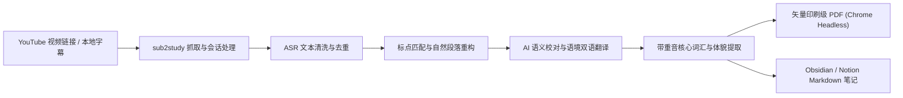

<div align="center">

# 📖 sub2study

**专为外语学习者打造的 YouTube 视频字幕精读讲义与 PDF 排版制作工具**

[](https://www.python.org/)
[](./LICENSE)
[]()
[]()

[简体中文](./README.md) · [开源协议](./LICENSE) · [问题反馈](https://github.com/wanxiao2018/sub2study/issues)

</div>

---

## 🌟 设计精髓与核心亮点

- **🧩 语音识别（ASR）文本断句重构**：
  彻底清洗 YouTube 自动字幕中普遍存在的滚屏重复词与碎片时间戳标签，严格依据句末标点（`.`、`!`、`?`）将破碎词条重新拼合为完整语句，并按 ~50 词语义聚合成自然连贯的阅读段落。
- **📑 严谨的整词排版与防截断机制**：
  针对俄语、德语等长单词丰富的语种，摒弃易引发断词异常的强制两端对齐，采用出版级自然左对齐与整词换行（`word-break: normal; hyphens: none`），确保每一个生词在 PDF 中都完整显示，绝无连字符跨行断开。
- **⏱️ 毫秒级时间戳锚点对照**：
  为每个重构段落精准保留原视频起始时间戳锚点（如 `[01:25]`）。学习过程中遇到生词发音疑惑或语调难点时，可一键在原视频中跳转复听定位。
- **📚 核心生词提取与重音规范标注**：
  根据视频全篇语境自动提炼 20~35 条高频核心词汇与地道表达，严格依循正音辞典标注急性重音符号（如 `претендова́ть`、`прока́чивать`、`шлифо́вка`），并提供词性、动词体貌（未完成体/完成体）及真实语境例句。
- **🌍 全语种智能自适应**：
  默认自动检测视频原生音轨语种（英语、俄语、日语、德语、法语、西班牙语等），同时支持显式指定语言代码。
- **📦 双格式学习资产输出**：
  - **A4 矢量精读讲义（.pdf）**：基于无头浏览器精确渲染，支持系统原生多语言字体，适合 iPad 批注与纸质打印；
  - **结构化双语笔记（.md）**：标准 Markdown 格式，便于无缝导入 Obsidian、Notion 与 Logseq 归档检索。

---

## 🏗️ 架构与处理流程



---

## 📄 产出讲义规格预览

生成的学习讲义包含两大核心板块：

### 1. 双语精读对照正文
| 元素 | 排版样式 | 说明 |
| :--- | :--- | :--- |
| **段落标头** | `段落 1 [00:00:28]` | 带有醒目的时间码徽章，便于定位原视频 |
| **原文卡片** | 14px 深青灰 · 自然左对齐 · 行高 1.65 | 完整保留词汇形态，标点规范，避免眼肌疲劳 |
| **译文底栏** | 13px 蓝灰框 · 左侧重音蓝边线条 | 依托整段语境进行的意译，专业术语精准对齐 |

### 2. 核心词汇与地道表达解析表
| 序号 | 单词 / 表达 (带重音) | 词性与语法 | 中文释义 | 视频语境搭配与例句 |
| :---: | :--- | :--- | :--- | :--- |
| **1** | **претендова́ть** | глагол несов. (на что-л.) | 期望，争取，主张 | *претендовать на балл 7.0 (争取达到7.0分)* |
| **2** | **отма́зка** | сущ. ж., разг. | 托词，借口 | *Отсутствие времени — это отмазка. (没时间不过是借口。)* |
| **3** | **наступа́ть на пя́тки**| фразеологизм | 紧追不舍，紧逼 | *китайский очень серьёзно наступает на пятки (追赶势头非常猛烈)* |

---

## 🚀 1 分钟快速上手

### 1. 克隆代码仓库
```bash
git clone https://github.com/wanxiao2018/sub2study.git
cd sub2study
```

### 2. 一键安装与配置
```bash
chmod +x install.sh
./install.sh
```
> 安装脚本会自动安装 `sub2study` 命令行工具，并检测配置本地运行环境。

*(或使用标准 Python 手动安装)*：
```bash
pip install -r requirements.txt
pip install -e .
```

---

## 💡 使用指南

### 方式一：配合 AI Agent（如 Google Antigravity）使用（推荐）

运行 `./install.sh` 后，系统会自动将 Skill 挂载至本地 AI Agent 配置目录。
在对话中直接发送任意视频链接：

> **“用 sub2study 帮我把这个视频做成双语学习讲义：https://www.youtube.com/watch?v=0-j8zPoJFJc”**

Agent 将自动启动端到端工作流：下载字幕 ➔ 智能断句 ➔ 语境校对与翻译 ➔ 提炼重音词汇表 ➔ 在桌面输出 PDF 与 Markdown。

---

### 方式二：终端命令行（CLI）独立使用

#### 步骤 1：下载并清洗字幕为结构化段落
```bash
sub2study extract "https://www.youtube.com/watch?v=0-j8zPoJFJc" -o ./output --lang auto
```
> 会在 `./output` 目录下生成清洗好、带时间戳的 `cleaned_paragraphs.json`。

#### 步骤 2：基于双语对照数据渲染导出 PDF 与 Markdown
将校对与翻译完成的 JSON 数据一键编译为排版讲义：
```bash
sub2study render ./output/bilingual_result.json \
  -o ./output \
  --title "AI时代的高效外语学习法" \
  --video-url "https://www.youtube.com/watch?v=0-j8zPoJFJc" \
  --speaker "Дмитрий Петров" \
  --source-lang ru
```

---

## 📂 项目结构

```
sub2study/
├── sub2study/                 # 核心模块源码
│   ├── __init__.py            # 版本信息 (v1.0.0)
│   ├── cli.py                 # 统一命令行入口
│   ├── cookie_resolver.py     # 浏览器会话安全解析与免密支持
│   ├── extractor.py           # 字幕抓取、去重与段落重构
│   └── renderer.py            # PDF 与 Markdown 排版生成器
├── skill/                     # AI Agent Skill 规则定义
│   └── SKILL.md               # Antigravity 原生 Skill 配置规范
├── install.sh                 # 一键安装脚本
├── setup.py                   # 模块打包定义
├── requirements.txt           # 基础运行依赖
├── LICENSE                    # MIT 开源协议
└── README.md                  # 项目中文说明文档
```

---

## 📄 开源许可证

本项目基于 [MIT License](./LICENSE) 开源发布。
