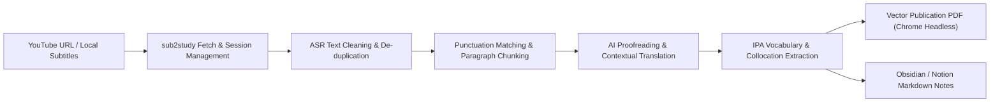

<div align="center">

# 🎓 sub2study

**Transform raw YouTube subtitles into publication-grade bilingual study guides (A4 PDF & Markdown notes) — Engineered for language learners, developers, and autonomous AI agents**

[](https://www.python.org/)
[](https://github.com/wanxiao2018/sub2study)
[](https://www.google.com/chrome/)
[](./skill/)
[](./LICENSE)

[English](./README.md) · [简体中文](./README_zh.md) · [Agent Guidelines](./skill/) · [License: MIT](./LICENSE)

</div>

---

## 🌟 Key Engineering Highlights

- **🧩 ASR De-duplication & Sentence Boundary Reconstruction**:
  Strips rolling word repetitions and inline `<c>` word tags from YouTube auto-generated captions. Reconstructs fragmented lines into complete sentences using punctuation boundaries (`.`, `!`, `?`), grouping them into coherent paragraphs (~50 words each).
- **📑 Whole-Word Typography (Zero Hyphen Fragmentation)**:
  Avoids forced justification and CSS hyphen chopping (`hyphens: auto`) that mutilates complex vocabulary. Enforces strict natural left-aligned typography (`text-align: left; hyphens: none; word-break: normal;`), guaranteeing every foreign word stays whole and readable in PDF.
- **⏱️ Timestamp Anchor Indexing**:
  Preserves precise source video timestamp anchors (`[MM:SS]`) for every reconstructed paragraph, allowing instant playback verification and pronunciation review directly in YouTube.
- **📚 International Phonetic Alphabet (IPA) & Lexical Collocations**:
  Extracts 15–25 high-leverage idioms, technical terms, and vocabulary items from the context, complete with IPA phonetic transcriptions, part of speech, concise translations, and in-situ video collocations.
- **🧹 Zero-Clutter Delivery Guarantee**:
  Temporary HTML layout targets are automatically purged after PDF compilation. Intermediate working JSON files are safely archived to `~/.sub2study/cache/`, ensuring the target output folder strictly contains **only the final deliverables** (`[Title].pdf` and `[Title].md`).
- **🤖 Autonomous AI Agent Ready**:
  Designed to work natively with **Claude Code**, **OpenAI Codex**, **Cursor**, and **Google Antigravity (AGY)** via built-in guidelines (`SKILL.md`, `CLAUDE.md`, `AGENTS.md`).
- **📦 Dual-Format Asset Generation**:
  - **A4 Vector PDF (`.pdf`)**: Compiled via Chromium headless rendering engine with native multi-language font support, ideal for iPad annotation and printing;
  - **Structured Markdown (`.md`)**: GitHub-flavored Markdown formatted for immediate import into Obsidian, Notion, or Logseq.

---

## 🏗️ Architecture & Data Pipeline



---

## 📑 Layout & Typography Specifications

### 1. Bilingual Card Specifications
| Region | Styling Specifications | Functional Intent |
| :--- | :--- | :--- |
| **Card Header** | Paragraph index + `[00:01:25]` monospace badge | Allows direct cross-referencing with video audio |
| **Source Text** | 14px dark slate · `text-align: left` · Line-height 1.65 | Prevents forced hyphen cutting on specialized terms |
| **Translation** | 13px blue-gray panel · 3.5px accent left border | Contextualized translation with domain terminology alignment |

### 2. Vocabulary Table Specification (Sample: Tech Salaries Video)
| # | Word / Expression (with IPA) | POS | Definition | Contextual Collocation from Video |
| :---: | :--- | :---: | :--- | :--- |
| **1** | **equity /ˈekwɪti/** | n. | Company stock / equity assets | *The stock, or companies call it equity* |
| **2** | **RSUs /ˌɑːr es ˈjuːz/** | n. | Restricted Stock Units | *The most common one is RSUs that tech companies give* |
| **3** | **vesting schedule** | n. | Stock vesting schedule | *Vesting determines the frequency with which stock is released* |
| **4** | **sign-on bonus** | n. | Sign-on / hiring bonus | *Sign-on bonus is a one-time payment* |

---

## 🚀 1-Minute Quickstart

### 1. Prerequisites
- **Python 3.9+**
- **yt-dlp**: `brew install yt-dlp` (macOS) or `pip install yt-dlp`
- **Chrome / Edge / Chromium**: Any desktop Chromium browser for headless PDF compilation

### 2. Installation
```bash
git clone https://github.com/wanxiao2018/sub2study.git
cd sub2study
chmod +x install.sh && ./install.sh
```
> The installer configures the editable Python CLI and creates a symlink in `~/.local/bin/sub2study`.

---

## 🤖 Using with AI Agents (Recommended)

`sub2study` is a modular Python CLI that any terminal-capable AI Agent can invoke directly:

- **Claude Code**: Native support via [`skill/CLAUDE.md`](./skill/CLAUDE.md).
- **Cursor / OpenAI Codex**: Guided via [`skill/AGENTS.md`](./skill/AGENTS.md).
- **Google Antigravity (AGY)**: Registered globally via [`skill/SKILL.md`](./skill/SKILL.md).

Simply send the video URL in your Agent chat:
> **"Use sub2study to turn this video into a bilingual study guide: https://www.youtube.com/watch?v=vJwoB34Tv2U"**

The Agent executes the end-to-end pipeline:
1. Downloads and cleans subtitles into coherent paragraphs;
2. Proofreads and translates contextually;
3. Extracts vocabulary with IPA transcriptions;
4. Compiles the PDF and Markdown, automatically cleaning up intermediate files.

---

## 💻 CLI Reference Manual

### Step 1: Extract & Clean Subtitles
```bash
sub2study extract "https://www.youtube.com/watch?v=vJwoB34Tv2U" -o ./output --lang auto
```
Options:
- `url`: YouTube video URL or path to local subtitle file (`--vtt`);
- `-o, --output-dir`: Output directory (default: current directory);
- `--lang`: Subtitle language code (default: `auto` to detect original audio);
- `--min-words`: Minimum word threshold per paragraph (default: `45`);
- `--keep-vtt`: Retain raw `.vtt` file in output directory (default: `False`).

### Step 2: AI Proofreading & Translation (`bilingual_result.json`)
Data structure:
```json
{
  "paragraphs": [
    { "timestamp": "00:00:00", "ru": "English source text...", "zh": "中文译文..." }
  ],
  "vocabulary": [
    { "word": "equity", "accent": "/ˈekwɪti/", "pos": "n.", "meaning": "公司股权", "collocation": "companies call it equity" }
  ]
}
```

### Step 3: Render Final Deliverables
```bash
sub2study render ./output/bilingual_result.json \
  -o ./output \
  --title "How Tech Salaries Actually Work" \
  --video-url "https://www.youtube.com/watch?v=vJwoB34Tv2U" \
  --speaker "Ex-Spotify Analyst" \
  --source-lang en
```
Options:
- `--keep-html`: Preserve intermediate HTML layout file (default: auto-removed);
- `--no-clean`: Prevent archiving intermediate JSON files (default: auto-archived to cache).

---

## 📂 Deliverable Directory Structure

Upon completion, the target directory strictly contains **only the final deliverables**:

```text
output/
├── How_Tech_Salaries_Actually_Work_Bilingual_Study_Guide.pdf  # Publication-grade A4 PDF
└── How_Tech_Salaries_Actually_Work_Bilingual_Study_Guide.md  # Structured Markdown study notes
```

---

## 📄 License

Distributed under the [MIT License](./LICENSE). Contributions, issues, and feature requests are welcome!
