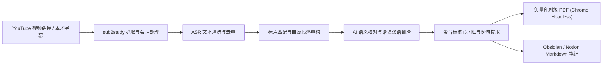

<div align="center">

# 🎓 sub2study

**将 YouTube 视频字幕自动重构成出版级双语精读讲义（A4 PDF + Markdown 笔记）的开源工程套件**

[](https://www.python.org/)
[](https://github.com/wanxiao2018/sub2study)
[](https://www.google.com/chrome/)
[](./skill/)
[](https://linux.do)
[](./LICENSE)

[English](./README.md) · [简体中文](./README_zh.md) · [LINUX DO 社区](https://linux.do) · [Agent 规范目录](./skill/) · [贡献指南](./CONTRIBUTING_zh.md) · [开源协议](./LICENSE)

</div>

---

## 🌟 工程特性与设计细节

- **🧩 语音识别（ASR）文本断句重构**：
  自动清洗 YouTube 自动字幕中普遍存在的滚动重复词与行内 `<c>` 标签。依据句末标点（`.`、`!`、`?`）重新组装碎片化语句，并按 ~50 词滑动窗口聚合成自然连贯的阅读段落。
- **📑 印刷级整词换行排版（防截断机制）**：
  针对外语长单词与专业术语排版痛点，彻底禁用 CSS `hyphens` 与强制两端对齐，采用出版级自然左对齐与整词换行规则（`text-align: left; hyphens: none; word-break: normal;`），确保每个词条在 PDF 中完整显示，绝无连字符跨行砍断。
- **⏱️ 毫秒级时间戳锚点索引**：
  每个重构段落精准保留原视频起始时间戳锚点（如 `[01:25]`）。学习过程中遇到生词发音疑惑或语调难点时，可在原视频中随时跳转定位复听。
- **📚 核心生词提取与国际音标（IPA）规范**：
  依托视频上下文语境提炼 15~25 条高频核心词汇、行业术语与地道短语，标注标准国际音标（IPA）或重音，附带词性、中文精准意译与原视频实境搭配例句。
- **🧹 纯净工作目录交付（零中间文件污染）**：
  PDF 渲染完毕后，临时 HTML 排版文件自动销毁，中间断句与翻译数据安全归档至系统缓存（`~/.sub2study/cache/`），输出目录**严格仅保留最终交付物**（`[Title].pdf` 与 `[Title].md`）。
- **🤖 全生态 AI Agent 原生支持**：
  不仅支持 Google Antigravity，还深度适配 **Claude Code**、**OpenAI Codex**、**Cursor** 等任意支持命令行调用的 Coding Agent，内置通用规范（`SKILL.md`、`CLAUDE.md`、`AGENTS.md`）。
- **📦 双格式学习资产输出**：
  - **A4 矢量印刷级讲义（.pdf）**：基于 Chromium 无头排版引擎生成，矢量排版，支持原生中外文字体，适合 iPad 批注与纸质打印；
  - **结构化双语笔记（.md）**：标准 Markdown 语法，无缝导入 Obsidian、Notion 与 Logseq 归档检索。

---

## 🏗️ 架构与数据流



---

## 📑 讲义排版与数据规范

### 1. 段落双语卡片规范
| 区域 | 排版技术参数 | 设计目的 |
| :--- | :--- | :--- |
| **标题头** | 段落序号 + `[00:01:25]` 毫秒锚点徽标 | 便于对照原视频音频反复精听 |
| **原文正文** | 14px 灰黑底色 · `text-align: left` · 行高 1.65 | 完整保留词形，禁用自动连字符断词 |
| **中文译文** | 13px 蓝灰框底 · 左侧 3.5px 强调边线 | 基于整段语境意译，专业术语精准对齐 |

### 2. 核心词汇表规范（以科技薪资视频为例）
| 序号 | 单词 / 表达 (带音标) | 词性 | 中文释义 | 视频语境搭配与例句 |
| :---: | :--- | :---: | :--- | :--- |
| **1** | **equity /ˈekwɪti/** | n. | 公司股权 / 股票资产 | *The stock, or companies call it equity (公司通常称之为股权)* |
| **2** | **RSUs /ˌɑːr es ˈjuːz/** | n. | 限制性股票单位 | *The most common one is RSUs that tech companies give (大厂最常见的激励形式)* |
| **3** | **vesting schedule** | n. | 股票归属计划 | *Vesting determines the frequency with which stock is released (决定股权分期解禁节奏)* |
| **4** | **sign-on bonus** | n. | 签字费 / 入职奖金 | *Sign-on bonus is a one-time payment (一次性发放的签约现金礼包)* |

---

## 🚀 1 分钟快速上手

### 1. 环境依赖检查
- **Python 3.9+**
- **yt-dlp**：`brew install yt-dlp`（macOS）或 `pip install yt-dlp`
- **Chrome / Edge / Chromium**：系统已安装任一桌面端 Chromium 浏览器（用于渲染 PDF）

### 2. 安装 sub2study
```bash
git clone https://github.com/wanxiao2018/sub2study.git
cd sub2study
chmod +x install.sh && ./install.sh
```
> 安装脚本会自动配置 Python 环境，并在 `~/.local/bin` 中创建 `sub2study` 软链接。

---

## 🤖 搭配各类 AI Agent 使用（推荐）

`sub2study` 本质上是一个标准的 Python 命令行工具，**任何支持终端交互的 AI Agent 均可原生调度**：

- **Claude Code 用户**：项目根目录已内置 [`skill/CLAUDE.md`](./skill/CLAUDE.md)，Claude Code 会自动加载工具执行链路。
- **Cursor / Codex 用户**：已内置 [`skill/AGENTS.md`](./skill/AGENTS.md)，供通用代码 Agent 作为工作流指令。
- **Google Antigravity (AGY) 用户**：运行 `./install.sh` 已将 [`skill/SKILL.md`](./skill/SKILL.md) 挂载至全局。

在任意 Agent 中发送任务提示词：
> **“用 sub2study 帮我把这个视频做成双语学习讲义：https://www.youtube.com/watch?v=vJwoB34Tv2U”**

Agent 将自动启动端到端工作流：
1. 提取并重构段落；
2. 进行语境润色与翻译；
3. 提取音标词汇；
4. 渲染 PDF 与 Markdown 并自动归档中间缓存。

---

## 💻 命令行 CLI 完整参数手册

### 步骤 1：下载并清洗字幕
```bash
sub2study extract "https://www.youtube.com/watch?v=vJwoB34Tv2U" -o ./output --lang auto
```
参数说明：
- `url`：YouTube 视频 URL 或本地字幕文件路径（`--vtt`）；
- `-o, --output-dir`：输出目录（默认当前目录）；
- `--lang`：字幕语言代码（默认 `auto` 自动检测原生音轨）；
- `--min-words`：每个阅读段落的最小词数阈值（默认 `45`）；
- `--keep-vtt`：是否在目标目录保留原始 `.vtt` 文件（默认不保留）。

### 步骤 2：由 AI 翻译并生成 bilingual_result.json
数据结构标准：
```json
{
  "paragraphs": [
    { "timestamp": "00:00:00", "ru": "English source text...", "zh": "中文译文..." }
  ],
  "vocabulary": [
    { "word": "equity", "accent": "/ˈekwɪti/", "pos": "n.", "meaning": "公司股权", "collocation": "companies call it equity" }
  ]
}
```

### 步骤 3：渲染最终交付资产
```bash
sub2study render ./output/bilingual_result.json \
  -o ./output \
  --title "科技大厂真实薪酬架构与谈薪内幕" \
  --video-url "https://www.youtube.com/watch?v=vJwoB34Tv2U" \
  --speaker "Ex-Spotify Analyst" \
  --source-lang en
```
参数说明：
- `--keep-html`：是否保留中间排版 HTML 文件（默认自动销毁）；
- `--no-clean`：是否禁止归档中间 JSON 数据文件（默认自动归档至缓存）。

---

## 📂 输出资产结构

执行完成后，目标文件夹下**仅保留最终交付物**：

```text
output/
├── How_Tech_Salaries_Actually_Work_Bilingual_Study_Guide.pdf  # A4 矢量印刷级精读讲义
└── How_Tech_Salaries_Actually_Work_Bilingual_Study_Guide.md  # 结构化双语精读笔记
```

---

## 🐧 社区与致谢

本项目认可并链接 **[LINUX DO (linux.do)](https://linux.do)** 社区。欢迎佬友在 L 站交流讨论、反馈问题并分享外语精读体验：
- 社区交流主站：[https://linux.do](https://linux.do)
- 欢迎交流各类语言的断句调优、Prompt 翻译经验与双语学习心得；
- 欢迎提出 Feature Request，共同打造更加精炼、实用的双语学习工程套件；
- 秉持「真诚、友善、团结、专业」的精神，共同推动开源工具的持续演进。

---

## 🤝 参与贡献

我们非常欢迎社区开发者的参与与建议！
请参阅 [CONTRIBUTING_zh.md](./CONTRIBUTING_zh.md) 了解如何提交 Issue、PR 规范以及本地调试指南。

---

## 📄 开源协议

本项目采用 [MIT 许可证](./LICENSE) 开源。欢迎提交 Issue 与 Pull Request 共同完善！
